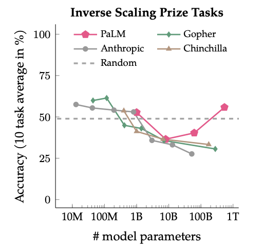

# BM-Principles

 🌟 The big models have proven their potential to lead to general artificial intelligence. However 😕, due to its rapid development, people have not fully grasped the principles of understanding and training large models. Therefore, in order to learn about large models together, we have decided to collect **new phenomena observed on the large models** and summarize them in this repository 📚 in the form of short entries. We hope this collection of phenomena observed during the scaling of large models may form future consensuses, principles, or patterns 📝. 

The repository focuses on two aspects:

- **How**: How to train powerful big models? 🚀
- **What**: What properties are interesting for large models? 🤔

The repo is far from exclusive currently. Let's work together to improve it! 💪

## How: how to train a powerful big model.

1. **Scaling of Computation**
   1. **Training loss decreases predictably.**
      - Training loss can be written as a smooth function of model parameters and computation.
      
      > [Scaling Laws for Neural Language Models](https://arxiv.org/abs/2001.08361)
      > [Scaling Laws for Autoregressive Generative Modeling](https://arxiv.org/abs/2010.14701)
  
   2. **Computational-optimal language model.**
      - Given a fixed computational budget, if we train an excessively large model, we can only iterate for a very limited number of steps. On the other hand, if we train a model that is too small, the limit of the loss will not be as good as that of a larger model. Therefore, there exists an *optimal model size*, *optimal training compute*, and *optimal tokens*. 
      - From previous experience, it's roughly $20 * N$, where $N$ is the number of model parameters.
      
      
      > [Training Compute-Optimal Large Language Models](https://arxiv.org/abs/2203.15556)

   3. **LLM doesn't converge at optimal compute.**
      - LLM might continue to improve the loss after optimal tokens. 
      - From Llama-7b and Llama-13b's training loss, we can see that continue to improve after 140 B and 260 B parameters.
      
      > [LLaMA: Open and Efficient Foundation Language Models](https://arxiv.org/abs/2302.13971)
`

   
   
2. **Optimal Hyperparameters.**
   1. **The best batch size is a function of loss.**
      - To reach a certain loss, a large batch size requires more compute, a small batch size requires more training steps (i.e., times). The best batch size is a trade-off.
      - Each diagonal line formed by the points represents a training process. The horizontal axis represents the training steps, the vertical axis represents the number of processed tokens, and the color depth represents the loss. The optimal batch size can be considered as the inflection point of each contour line of loss.
      
      
      
      > [Scaling Laws for Neural Language Models](https://arxiv.org/abs/2001.08361)
   2. **Large batch size allows a large learning rate,**
      1. Generally, a larger batch size allows a larger learning rate. And the larger learning rate has faster convergence. 
   
      > [Don't decay the learning rate, increase the batch size](https://arxiv.org/abs/1711.00489)
   

   3. **Cosine scheduler is the prevalent.**
      - Cosine scheduler is the prevalent one, which is better than Noam with the same peak learning rate. Noam decreases more sharply. 
      - Below is our experiment for CPM.

        

   4. **Cosine learning rate's period should be set to the end step.**
      - From 2.3, you might wonder if it is good to keep the learning rate high is good for training. But it's not.
      - When you want to traing $N$ step, it's best to set the period of scheduler to $N$, not bigger or smaller. 
      
         

3. **Predictable Scaling.**
   1. **Pass rate on human eval can be predicted with 1/10000 compute.**
      - It's important to forecast the model's ability before it is trained. OpenAI GPT-4 proposed the first version of predictable scaling. It estimate the Human-eval's pass rate 
      - Current there is no other public result of predicting the downstream metrics for large models. 
      
   
4. **Model Architecture**
   1. **Architectures in a diverse range has a similar pre-training loss.**
      
      > [Scaling Laws for Neural Language Models](https://arxiv.org/abs/2001.08361)
   
   

   2. **For downstream metrics, we prefer deepnarrow architecture.** 
   
      > [Scale Efficiently: Insights from Pre-training and Fine-tuning Transformers](https://arxiv.org/pdf/2109.10686.pdf)

   3. **Normalization has not reached consensus, but pre-norm is more popular recently.**
      - Here we list the normalization techniques of publicly known models.
   
      | Model| Normalization |
      | ---- |  -----|
      | Llama | Pre-norm |
      | GLM | PostNorm + DeepNorm |
      | Pythia | PostNorm |
      | BLOOM | PreNorm |
      | StarCoder | PreNorm |
   
      > [DeepNet: Scaling Transformers to 1,000 Layers]()

5. **Data Mixture**
   1. **Diversity improves zero-shot generalization.**
      - Diverse cross-domain pretraining data combining web crawls with curated high-quality sources significantly improves zero-shot generalization over pretraining datasets constructed from Common Crawl only.
      > [What Language Model to Train if You Have One Million GPU Hours?](https://arxiv.org/abs/2210.15424)

      

   2. **Data portion is important.**
      1. Re-mix the dataset in Pile boosts the convergence speed and performance. 

      

      > [DoReMi: Optimizing Data Mixtures Speeds Up Language Model Pretraining](https://arxiv.org/abs/2305.10429)

   3. **Code might contribute to reasoning ability.**
      - There is a wide belief that pre-training on code results in the strong cabability of reasoning. But currently, there is no quantitative verification.

      > [How does GPT Obtain its Ability? Tracing Emergent Abilities of Language Models to their Sources](https://yaofu.notion.site/How-does-GPT-Obtain-its-Ability-Tracing-Emergent-Abilities-of-Language-Models-to-their-Sources-b9a57ac0fcf74f30a1ab9e3e36fa1dc1)

## What: what properties are interesting for large models?
1. **Emergent ability**
   1. **Emergent ability is observed with models ~ 50B or larger**
      

      > [Emergent Abilities of Large Language Models](https://arxiv.org/pdf/2206.07682.pdf)

   2. **Popular method only works on large models.**
      - Prompt tuning, Delta tuning works well for models larger than 1B
      - In-context Learning, Chain-of-thought reasoning works for larger models.

      
      

      > [Emergent Abilities of Large Language Models](https://arxiv.org/pdf/2206.07682.pdf)
      > [Delta Tuning: A Comprehensive Study of Parameter Efficient Methods for Pre-trained Language Model](https://arxiv.org/pdf/2203.06904.pdf)

   1. **U-shape scaling**
      - Some task scaling curve exhibit U-shape
      

      > [Inverse scaling can become U-shaped](https://arxiv.org/abs/2211.02011)

1. **Training Dynamics.**
   1. **Double Descent phenomenon is observed.**
      - There is a regime that improving model size harms performance.
      - Closely resembles the inverse scaling phenomenon.
      

      > [Deep double descent](https://openai.com/research/deep-double-descent)

   2. **Grokking phenomenon might contribute to generalization.**
      - overparameterized neural networks show a sign of a sudden improvement in generalization.
      

      > [Grokking: Generalization Beyond Overfitting on Small Algorithmic Datasets](https://arxiv.org/pdf/2201.02177.pdf)

   3. **Modularity emerge in LLM.**
      - Sparse Activation has been observed in big models.
      - The sparsity of modules tends to form in early stage.
      - The sparsity of neurons tends to form later. 

      

      > [Emergent Modularity in Pre-trained Transformer](https://openreview.net/forum?id=XHuQacT6sa6)
   
